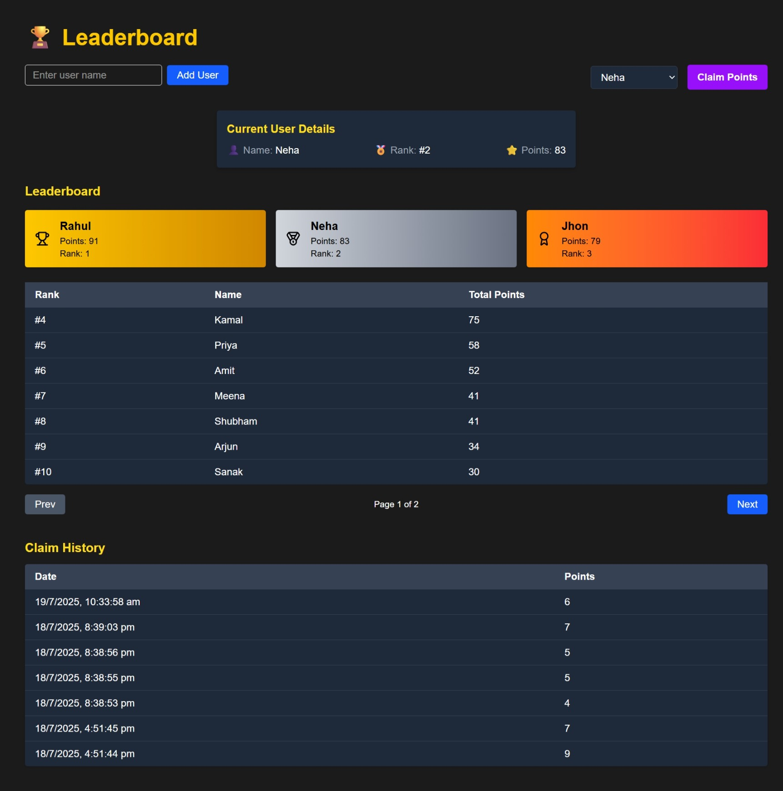

# 🏆 Leaderboard App 

This is a full-stack Leaderboard application built with:

- ⚙️ **Backend**: Node.js + Express + TypeScript + MongoDB
- 💻 **Frontend**: React + TypeScript + Tailwind CSS + Vite
- 🧠 Features:
  - Add new users
  - Claim points
  - Track claim history
  - Dynamic leaderboard with pagination
  - Responsive and styled with Tailwind

---

## 📸 Screenshots

### Leaderboard


---

## 📁 Project Structure

```
guptashubham-11-leaderboard/
├── client/       # Frontend (React + Vite)
└── server/       # Backend (Express + MongoDB)
```

---

## 🚀 Setup Instructions

### 🧩 Prerequisites

- Node.js (v18+ recommended)
- pnpm (or use `npm` or `yarn`)
- MongoDB (local or cloud)
- [Optional] `.env` file for each part (see `.env.sample`)

---

### 1️⃣ Clone the Repository

```bash
git clone https://github.com/guptashubham-11/leaderboard.git
cd guptashubham-11-leaderboard
```

---

### 2️⃣ Server Setup (Backend)

```bash
cd server
pnpm install         # or npm install
cp .env.sample .env  # configure MongoDB URI
pnpm dev             # starts backend on port 5000
```

#### `.env.local` example:

```env
PORT = 3000
MONGODB_URI = DB_URI
CLIENT_URL = FRONTEND_URL
DB_NAME = leadboard_db
```

---

### 3️⃣ Client Setup (Frontend)

```bash
cd ../client
pnpm install
pnpm dev             # starts frontend on port 5173
```

#### `.env.local` example (if using environment variables):

```env
VITE_SERVER_API_URL = BACKEND_URL
```

---

## 🔧 Available Scripts

### Server

| Script        | Command         | Description              |
|---------------|-----------------|--------------------------|
| `dev`         | `pnpm dev`      | Start backend (ts-node)  |
| `build`       | `tsc`           | Compile TypeScript       |

### Client

| Script        | Command         | Description              |
|---------------|-----------------|--------------------------|
| `dev`         | `pnpm dev`      | Start frontend (Vite)    |
| `build`       | `pnpm build`    | Build production client  |
| `preview`     | `pnpm preview`  | Preview built site       |

---

## 📚 Technologies Used

- **Frontend**: React, TypeScript, Tailwind CSS, Axios
- **Backend**: Express, TypeScript, MongoDB, Mongoose
- **Utilities**: dotenv, cors, async-handler, custom API response/error wrappers

---

## 🧑‍💻 Author

- **Shubham Gupta**
- GitHub: [@guptashubham-11](https://github.com/guptashubham-11)
- Portfolio: [guptashubham-11.com](https://gupta-shubham-11.vercel.app)

---